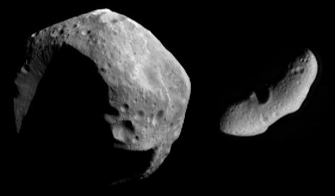

# NASA NEOWS Data Viewer 🌌

Welcome to the NASA NEOWS Data Viewer, your gateway to exploring near-Earth objects (NEOs) 🚀🪨. This platform is designed to make it easy for users to view and explore raw data from NASA's NEOWS, making space data accessible and understandable for everyone, from enthusiasts to researchers.

*Image Credit: NASA/JPL/JHUAPL*

## Features

- **Date Range Selection:** Choose a specific range of dates to explore asteroids that were close to Earth during that period.
- **Asteroid Details:** View detailed information about each asteroid, including its size, velocity, distance from Earth, and more.
- **Interactive Exploration:** Utilize filters and selectors to narrow down your search and explore the data in an interactive manner.

## About NEOWS

The Near Earth Object Web Service (NEOWS) is a RESTful web service provided by NASA to offer information about near-Earth asteroids. It includes data on asteroid close approaches to Earth and allows users to search for specific asteroids or browse the dataset to discover new findings. NEOWS is maintained by NASA's Center for Near-Earth Object Studies (CNEOS).

For more information, visit the [NASA API Portal](https://api.nasa.gov/).

## Live Demo

Check out the [live demo](https://space-project.streamlit.app/) to explore the application.

## Getting Started

To run this Streamlit app locally, follow these steps:

1. Clone the repository:

`git clone https://github.com/dezeraym/space-project.git`

2. Navigate to the project directory:

`cd space-project/app/`

3. Install the required Python packages:

`pip install -r requirements.txt`

4. Run the Streamlit app:

`streamlit run Hello.py`

## Explore, Discover, Learn

Join us on a journey through the cosmos as we uncover the mysteries of the universe, one asteroid at a time. Whether you're a space enthusiast, a student, or a researcher, the NASA NEOWS Data Viewer offers a unique window into the vast universe of asteroid information.

---

**Note:** This project is not affiliated with NASA but utilizes the NEOWS API provided by NASA for educational and informational purposes.

